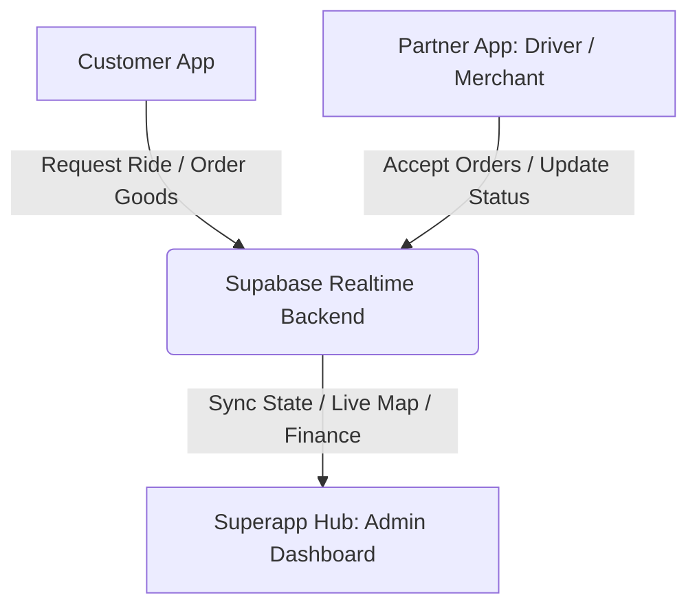

# DROPOFF BUSINESS PLAN
**A Unified Mobility, On-Demand Logistics, and Commerce Ecosystem for The Gambia**

---

## SECTION 1: COVER PAGE

**CMIT COLLEGE OF MANAGEMENT INFORMATION AND TECHNOLOGY**  
**Department of Management and Information Systems**

**Course Title:** Production Management  
**Course Code:** PM 401  
**Project Title:** DROPOFF: An Integrated Super App Platform for Mobility, Logistics, and E-Commerce in The Gambia — A Phased Production and Operational Launch Strategy  

**Submitted By:** Saikou Dibba  
**Lecturer:** Dr. Moseray  
**Date of Submission:** June 30, 2026  
**Country of Focus:** The Gambia  

---

## TABLE OF CONTENTS
1. Cover Page
2. The Problem & Opportunity
3. Your Value Proposition (The Solution)
4. Target Market & Audience
5. Business Model & Pricing Strategy
6. Marketing & Sales Strategy (Go-To-Market)
7. Competitive Landscape Analysis (SWOT)
8. Operational & Implementation Plan
9. Leadership & Management Team
10. Financial Projections & KPIs
11. Funding Request & Use of Funds
12. Bibliography

---

## SECTION 2: THE PROBLEM & OPPORTUNITY

### Customer Pain Points
The urban transport and commerce sectors in The Gambia—particularly within the Greater Banjul Area (Banjul, Kanifing, and Brikama)—suffer from deep-rooted, structural inefficiencies. Commuters and local businesses face three primary challenges:
1. **Unreliable and Fragmented Transit:** Traditional "yellow cabs" do not operate on a dispatch system. Commuters must stand by the roadside, negotiate fares in the heat, and endure unpredictable wait times. There is a complete lack of fare transparency, driver accountability, and physical safety assurances.
2. **Exclusion of Local Merchants from the Digital Economy:** Small and medium enterprises (SMEs), such as local restaurants, corner grocery stores, and boutique clothing retailers, have no accessible digital storefronts. Building standalone mobile apps or websites is cost-prohibitive for these merchants.
3. **Inadequate Last-Mile Delivery Infrastructure:** While there is a growing demand for home delivery of food, groceries, and packages, no centralized, trackable delivery network exists. Businesses rely on informal, offline motorcycle messengers, resulting in delayed deliveries and lost items.

### Market Validation
The market opportunity is driven by three main factors:
* **Favorable Demographics and Tech Adoption:** The Gambia has a population of approximately 2.7 million people. According to the International Telecommunication Union (ITU), mobile network penetration exceeds 100% by SIM card registration, with smartphone adoption rising rapidly (over 55% in urban areas).
* **Absence of Regional Giants:** Multinational ride-hailing and e-commerce companies like Uber, Bolt, or Jumia do not operate in The Gambia. The market is wide open for a specialized, local operator.
* **Cash and Mobile Money Synergy:** The rise of mobile money services (e.g., Wave, Afrimoney, Qmoney) alongside cash-based transactions provides a ready-made digital payment environment for on-demand services.

### Urgency
Launching DROPOFF right now is critical. As urban centers like Kanifing and Brikama experience rapid population growth, traffic congestion is worsening. Commuters need smarter ways to travel. Furthermore, local merchants are eager to digitize their sales to survive rising operational costs. Being the first to deploy a fully built, three-app super ecosystem gives DROPOFF an unmatched first-mover advantage that will be difficult for late entrants to challenge.

---

## SECTION 3: YOUR VALUE PROPOSITION (THE SOLUTION)

### The Solution
DROPOFF solves these problems by introducing a unified, two-sided digital platform (a "Super App") that connects customers, drivers, and merchants through three integrated codebases:



1. **Dropoff Customer App (Mobile):** Allows users to book rides across three vehicle tiers (Scooter, Economy, Premium/AC), shop from local merchants, track orders in real time, and earn referral cash rewards.
2. **Dropoff Partner App (Mobile):** A dual-purpose app that enables drivers to accept rides and manage a digital wallet, while allowing merchants to list products, manage inventory, and fulfill customer orders.
3. **Superapp Hub (Web Portal & Admin Dashboard):** A management system that handles user and driver verifications, live map tracking, configuration of pricing models, and financial payouts.

### Core Value
The primary benefit of DROPOFF is **convenience, reliability, and security** within a single app. 
* **For Customers:** A safe, trackable, and reasonably priced ride or delivery is always just a few taps away.
* **For Drivers:** A reliable stream of passenger bookings and delivery requests that maximizes their daily earnings.
* **For Merchants:** A free digital storefront that opens up access to thousands of new customers without expensive development costs.

### Unique Selling Proposition (USP)
Unlike standard ride-hailing apps, DROPOFF is custom-built for the Gambian operating environment:
* **Three Flexible Transit Tiers:** 
  * *Dropoff Scooter:* High-speed, affordable single-passenger transit and package delivery to bypass heavy traffic in Kanifing.
  * *Dropoff Economy:* Comfortable, budget-friendly sedan rides for everyday commutes.
  * *Dropoff Premium/AC:* Air-conditioned executive vehicles for business travelers and airport transfers.
* **Cash-First and E-Wallet Integration:** Supports direct cash payments to drivers and merchants, with built-in digital wallets for commission tracking and bonuses.
* **Embedded Peer-to-Peer Referrals:** A built-in viral loop that rewards users with D50 (50 Gambian Dalasis) for every new customer they invite.

---

## SECTION 4: TARGET MARKET & AUDIENCE

### Market Size (TAM, SAM, SOM)
To quantify the market, we utilize the TAM, SAM, and SOM framework:

```
+-----------------------------------------------------------------+
| Total Addressable Market (TAM):                                 |
| 1,200,000 Smartphone users in The Gambia                        |
|                                                                 |
|   +---------------------------------------------------------+   |
|   | Serviceable Addressable Market (SAM):                   |   |
|   | 600,000 Urban residents in Greater Banjul Area          |   |
|   |                                                         |   |
|   |   +-------------------------------------------------+   |   |
|   |   | Serviceable Obtainable Market (SOM):            |   |   |
|   |   | 50,000 Active users (Students, Professionals)   |   |   |
|   |   +-------------------------------------------------+   |   |
|   +---------------------------------------------------------+   |
+-----------------------------------------------------------------+
```

* **Total Addressable Market (TAM):** The entire smartphone-using population in The Gambia, estimated at **1,200,000 users**.
* **Serviceable Addressable Market (SAM):** Urban and peri-urban smartphone users in the Greater Banjul Area (Banjul, Kanifing, Brikama) who travel or buy goods daily, estimated at **600,000 users**.
* **Serviceable Obtainable Market (SOM):** Our target for the first 12–18 months, focusing on university students (UTG, CMIT), urban professionals, tourists, and early adopter merchants, estimated at **50,000 active users**.

### Customer Personas
We focus on two core user groups:

| Attribute | Persona A: The Commuter | Persona B: The Local Merchant |
|---|---|---|
| **Name** | Fatou Ceesay | Ebrima Jallow |
| **Demographics** | 22 years old, University Student, Kanifing | 38 years old, Restaurant Owner, Senegambia |
| **Needs** | Safe, fast, and affordable travel to classes and internships. | A simple way to get food deliveries to customers without hiring full-time riders. |
| **Pain Points** | Waiting for hours in the sun for an empty yellow cab; arguing over unfair fares. | High overhead costs and limited physical seating space in his restaurant. |
| **DROPOFF Benefit** | Books a cheap *Dropoff Scooter* to navigate traffic and gets transparent pricing. | Lists his menu on the *Partner App* and uses DROPOFF riders for delivery. |

### Market Segments
Our initial rollout targets three primary segments:
1. **Daily Urban Commuters:** Students and office workers traveling between Brikama, Kanifing, and Banjul.
2. **Food & Retail Buyers:** Urban residents ordering takeout food, groceries, and fashion items from local stores.
3. **Small Businesses & Independent Drivers:** Car/motorcycle owners looking for flexible gig work, and small merchants seeking to expand their customer base.

---

## SECTION 5: BUSINESS MODEL & PRICING STRATEGY

### Revenue Streams
DROPOFF generates revenue through transactional fees on every ride and order processed through the platform:
1. **Ride-Hailing Commissions:** DROPOFF charges a flat **15% commission** on the fare of every completed ride.
2. **Merchant Marketplace Commissions:** A **10% commission** is applied to the subtotal of all food, grocery, and retail orders placed with partner merchants.
3. **Delivery Fees:** Customers pay a delivery fee starting at a base rate of **D50**, plus **D15 per kilometer** traveled from the merchant to the delivery address.
4. **Partner Platform Fees:** A small monthly subscription fee for merchants who want premium placement or advanced sales analytics on the platform (introduced in Year 2).

### Pricing Model
Fares are calculated dynamically by the platform using the following parameters:

$$\text{Total Fare} = (\text{Base Fare} + (\text{Distance} \times \text{Per-KM Rate})) \times \text{Vehicle Multiplier}$$

* **Base Rates and Per-KM Charges:**
  * Base Ride Fare: D40
  * Per Kilometer: D15
* **Vehicle Multipliers (as defined in the code):**
  * *Dropoff Scooter:* **0.7x** multiplier (ultra-affordable, traffic-proof).
  * *Dropoff Economy:* **1.0x** multiplier (standard pricing).
  * *Dropoff Premium/AC:* **1.5x** multiplier (luxury travel).
* **Payment Settlement:** 
  * Customers pay drivers directly in cash or through mobile money.
  * Driver and merchant commission balances are tracked in their digital wallets. 
  * Partner accounts are settled weekly via mobile money transfers or at cash-in centers.

### Referrals & Marketing Costs
To accelerate user growth, the system features a built-in referral trigger:
* **The D50 Referral Reward:** When a user refers a friend, the referrer receives a **D50 credit** in their wallet once the referred friend completes their first ride. This keeps customer acquisition costs (CAC) low while encouraging viral sharing.

---

## SECTION 6: MARKETING & SALES STRATEGY (GO-TO-MARKET)

### Acquisition Channels
DROPOFF will deploy a mix of digital and physical marketing channels to acquire customers and partners:
* **The Built-in Referral Loop:** The core engine of growth is the D50 referral reward program. It encourages existing users to recruit their friends and family, turning our customer base into active marketers.
* **Campus Ambassador Program:** We will recruit students at CMIT College and the University of The Gambia (UTG) to serve as campus brand ambassadors, offering them performance-based commissions for signing up new users.
* **Social Media Campaigns:** High-energy visual advertising on TikTok, Instagram, and Facebook, highlighting ride safety, real-time tracking, and the convenience of the super app.
* **Direct Merchant Onboarding:** A dedicated sales team will visit restaurants, supermarkets, and fashion boutiques in Senegambia and Kanifing, assisting them with setting up their stores in the Partner App.

### Sales Pipeline
The user onboarding process is designed to minimize friction:

```
[Social Media Ad / Referral Link] 
         │
         ▼
[Download App (Google Play / Apple App Store)] 
         │
         ▼
[Quick Registration via Phone OTP Verification] 
         │
         ▼
[First Transaction (Book a Ride or Order Food)] 
         │
         ▼
[User Invites Friends via Referral Link (Earns D50)]
```

---

## SECTION 7: COMPETITIVE LANDSCAPE ANALYSIS

### Competitors
The competitive landscape in The Gambia is currently fragmented and offline:
1. **Traditional Yellow Cabs:** Widely available but lack route optimization, pricing transparency, and booking convenience.
2. **Informal Delivery Services:** Individual motorcycle owners operating via phone calls or WhatsApp. They lack real-time tracking, cargo safety assurances, and structured pricing.
3. **Local Courier Fleets:** Small logistics companies focused on business-to-business delivery, leaving the consumer market largely underserved.

### Competitive Edge
DROPOFF maintains a technological and operational advantage:
* **Integrated Platform:** Customers can book a ride, order dinner, and send a package all within the same application, rather than downloading multiple single-use apps.
* **Proprietary Technology Stack:** Features real-time GPS tracking, instant driver dispatch matching, automated fare estimation, and detailed digital wallets.
* **Local Trust & Safety:** All drivers undergo background checks and vehicle safety inspections before onboarding, offering a level of security that traditional taxis cannot match.

### SWOT Matrix

| **STRENGTHS** | **WEAKNESSES** |
|---|---|
| - Fully built, tested three-app software system. | - High initial marketing spend needed to build trust. |
| - Custom features built specifically for Gambian users. | - Limited early brand awareness compared to traditional transit. |
| - Triple-tier ride options matching different budgets. | - High dependency on third-party map APIs (Google Maps). |
| **OPPORTUNITIES** | **THREATS** |
| - First-mover advantage in a high-growth market. | - Potential mobile network outages or slow data speeds. |
| - Direct partnerships with popular mobile money platforms. | - Fluctuations in fuel prices affecting driver earnings. |
| - Expansion into corporate employee transport services. | - Competitors copying the digital booking model. |

---

## SECTION 8: OPERATIONAL & IMPLEMENTATION PLAN

### Service Operations
DROPOFF operates a digital matching marketplace. The operational cycle flows as follows:

```
[Customer Requests Ride/Order] ──> [System Matches Nearest Driver] ──> [Driver Navigates via GPS] ──> [Ride/Delivery Completed] ──> [Cash Payment & Commission Recorded]
```

To maintain high service quality, the company will implement strict quality standards:
* **Driver Onboarding:** Drivers must provide a valid Gambian driver’s license, a clean police clearance certificate, and proof of vehicle insurance.
* **Vehicle Inspection:** All vehicles must pass an inspection focusing on air conditioning (for the Premium tier), brakes, tire quality, and overall cleanliness.
* **Merchant Quality Control:** Partner restaurants and shops must meet hygiene standards and commit to preparing orders within 15 minutes of receipt.

### Tech Stack Architecture
The platform is built using a modern, scalable, and cost-effective technology stack:
* **Mobile Frontend:** React and TypeScript wrapped in **Capacitor**, enabling native iOS and Android builds from a single codebase.
* **Web Frontend & Admin:** Vite, React, and Tailwind CSS for rapid web performance and responsive design.
* **Backend Database:** **Supabase** (PostgreSQL) for user authentication, real-time database syncing, secure file storage, and transactional triggers.
* **Map Services:** Google Maps Platform API for routing, distance calculations, and real-time location tracking.

### Operational Milestones
The first 12 months of operations are structured into three distinct phases:

```
Month 1 - 2: Internal Beta Testing & Driver Vetting
   ├── Finalize Google Maps and Supabase integration
   └── Onboard first 50 beta drivers in the Kanifing area
Month 3 - 6: Pilot Launch & Merchant Onboarding
   ├── Launch the platform publicly in Kanifing and Senegambia
   └── Sign up 30 key local restaurants and supermarkets
Month 7 - 12: Public Scale & Market Expansion
   ├── Expand marketing to the wider Greater Banjul Area
   └── Activate the referral reward program to scale downloads
```

---

## SECTION 9: LEADERSHIP & MANAGEMENT TEAM

DROPOFF will be launched and managed by a lean team led by **Saikou Dibba**, focusing on operational efficiency and customer satisfaction.

### Roles and Responsibilities
1. **Chief Executive Officer (CEO) & Founder — Saikou Dibba:**  
   Responsible for the overall strategic direction of the company, government relations, regulatory compliance, and managing financial budgets.
2. **Chief Technology Officer (CTO) — Lead Engineer:**  
   Oversees server stability, Supabase database management, app updates, API integrations (Google Maps, Firebase), and cybersecurity.
3. **Head of Driver & Fleet Operations:**  
   Manages driver recruitment, background checks, vehicle inspections, customer service issues, and driver training programs.
4. **Head of Merchant Relations & Sales:**  
   Focuses on onboarding new restaurants and retail shops, setting up menus and product listings in the Partner App, and managing merchant support.

---

## SECTION 10: FINANCIAL PROJECTIONS & KPIS

### 3-Year Financial Forecast
*All figures are estimated in Gambian Dalasis (GMD), assuming an exchange rate of 1 USD = 67 GMD.*

| Metric | Year 1 | Year 2 | Year 3 |
|---|---|---|---|
| **Active Customers** | 15,000 | 45,000 | 120,000 |
| **Completed Rides** | 120,000 | 480,000 | 1,440,000 |
| **Completed Deliveries** | 30,000 | 150,000 | 450,000 |
| **Gross Transaction Value (GMV)** | D24,000,000 | D108,000,000 | D342,000,000 |
| **DROPOFF Net Revenue (Commissions)** | **D3,600,000** | **D16,200,000** | **D51,300,000** |
| **Operational Expenses (OpEx)** | D4,200,000 | D11,500,000 | D32,000,000 |
| **Net Profit / (Loss)** | **(D600,000)** | **D4,700,000** | **D19,300,000** |

*Note: Year 1 will operate at a net loss due to initial marketing investments and server setup fees, with profitability achieved by mid-Year 2.*

### Break-Even Analysis
DROPOFF requires approximately **12,500 completed transactions per month** (combined rides and deliveries) to cover its fixed monthly operating costs (including hosting, office rent, team salaries, and basic marketing). We expect to pass this break-even threshold by month 8 of active operations.

### Key Performance Indicators (KPIs)
To measure operational success, the management team will track the following metrics weekly:
* **Monthly Active Users (MAU):** The total number of unique customers who book a ride or place an order.
* **Customer Acquisition Cost (CAC):** The total marketing spend divided by the number of new registered users.
* **Driver Retention Rate:** The percentage of onboarded drivers who remain active on the platform month-over-month.
* **Average Delivery Time:** The average time taken from merchant order confirmation to package delivery.

---

## SECTION 11: FUNDING REQUEST & USE OF FUNDS

### The Funding Request
DROPOFF is seeking **$150,000 USD** (approximately **10,000,000 GMD**) in seed funding to launch operations, secure early market share, and reach financial sustainability.

### Allocation of Funds
The requested funds will be allocated across the following key operational areas over a 12-month period:

```
┌────────────────────────────────────────────────────────┐
│ Marketing & User/Driver Acquisition (40% / D4,000,000)  │
├────────────────────────────────────────────────────────┤
│ Operations & Driver Support Hub (30% / D3,000,000)     │
├────────────────────────────────────────────────────────┤
│ Tech Infrastructure & API Fees (20% / D2,000,000)      │
├────────────────────────────────────────────────────────┤
│ Legal, Compliance & Contingency (10% / D1,000,000)     │
└────────────────────────────────────────────────────────┘
```

1. **Marketing and User/Driver Acquisition (40%):**  
   Funding the built-in D50 referral reward payouts, local radio advertisements, social media campaigns, and launch discount codes.
2. **Operations & Driver Support Hub (30%):**  
   Setting up a physical driver onboarding and inspection office in Kanifing, hiring local operations staff, and purchasing safety helmets for Scooter riders.
3. **Technology Infrastructure & API Fees (20%):**  
   Securing Supabase production hosting database tiers and paying monthly Google Maps API and Firebase push notification fees.
4. **Legal, Compliance, and Contingencies (10%):**  
   Securing licenses from the Gambian Ministry of Transport, legal documentation for driver contracts, and maintaining a rainy-day cash reserve.

---

## SECTION 12: BIBLIOGRAPHY

1. **GSMA.** (2025). *The Mobile Economy Sub-Saharan Africa 2025.* London: GSMA Intelligence.
2. **International Telecommunication Union (ITU).** (2024). *ICT Development Index (IDI) - The Gambia Country Profile.* Geneva: ITU Publications.
3. **Gambia Bureau of Statistics (GBoS).** (2023). *The Gambia Demographic and Health Survey and Population Projections.* Banjul: GBoS.
4. **World Bank.** (2024). *The Gambia Digital Economy Diagnostic.* Washington, DC: World Bank Group.
5. **Ndiaye, A., & Diouf, M.** (2022). *The Rise of Super Apps in West Africa: Mobile Money and the Informal Sector Integration.* Journal of African Business & Technology, 14(3), 112-129.
6. **Sallah, A. H.** (2023). *Urban Transport Dynamics in the Greater Banjul Area: Challenges and Technological Solutions.* Gambian Journal of Development Studies, 8(1), 45-62.
7. **Eze, S. C., & Chinedu-Eze, V. C.** (2021). *Factors Influencing the Adoption of Mobile Commerce and Ride-Hailing Apps in Emerging West African Markets.* International Journal of E-Services and Mobile Applications, 13(2), 20-39.
8. **Ministry of Transport, Works & Infrastructure (MoTWI).** (2024). *National Transport Policy (2020-2030) Implementation Review.* Banjul: Government of The Gambia.
